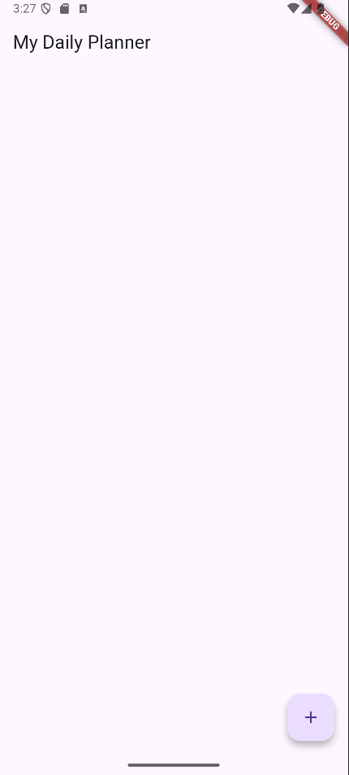
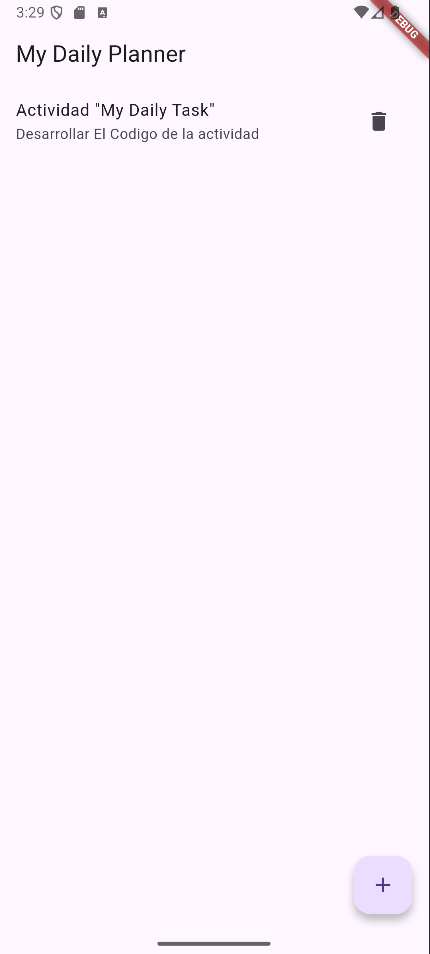

# Mobile Computing – My Daily Planner

Este proyecto fue desarrollado como parte de la clase Computación Móvil.
La aplicación permite manejar tareas diarias mediante un modelo simple, un formulario para crear/editar tareas y una pantalla para listar todas las tareas creadas.

### Pantalla de lista de tareas vacia

### Pantalla de lista de tareas con una actividad

