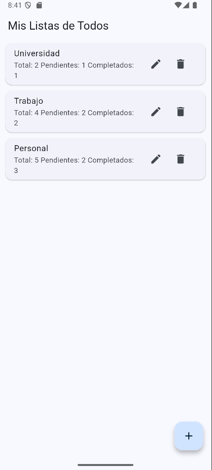
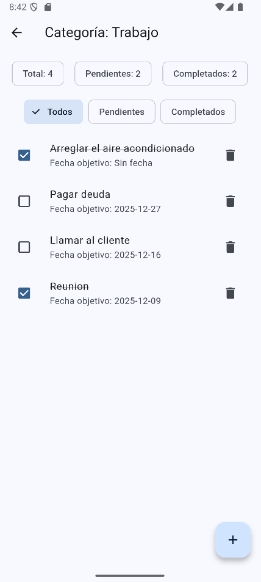

# Todo Categories App

Aplicación móvil desarrollada en **Flutter** para organizar tareas (Todos) por categorías.

Permite:
- Crear, editar y eliminar categorías
- Agregar tareas con fecha objetivo
- Marcar tareas como completadas
- Filtrar tareas (todas, pendientes y completadas)

---

## 📱 Vista previa de la aplicación

### Pantalla principal

### Detalle de categoría

---

## 🛠️ Tecnologías utilizadas
- Flutter
- Dart
- Provider (manejo de estado)

---

## 📚 Curso
Mobile Computing
